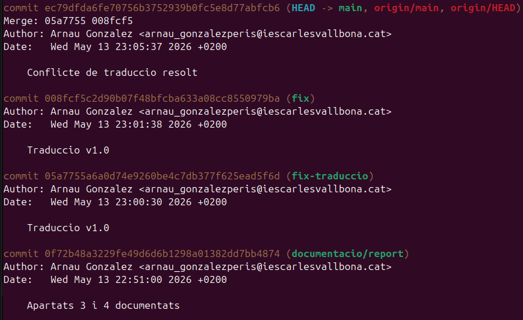
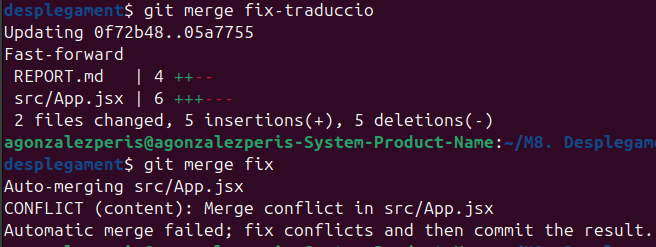
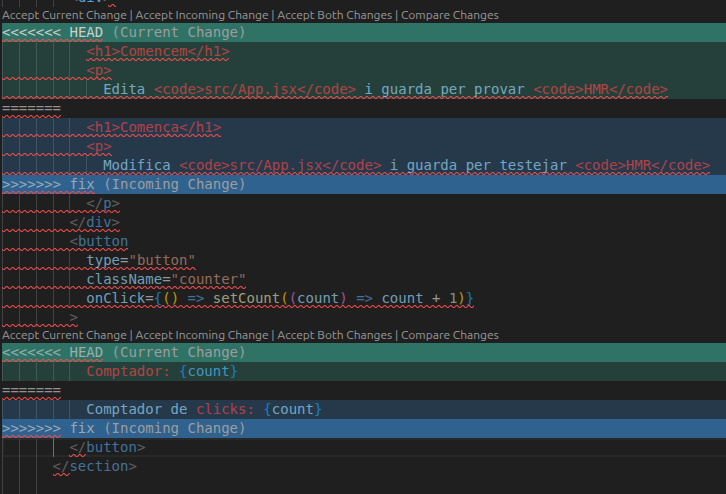

# REPORT – Projecte de Síntesi

## 1. Dades generals

Nom del projecte: projecte-sintesi-desplegament

Integrants: Arnau Gonzalez

Tecnologia principal (Laravel / React / Fullstack): React

Enllaç al repositori: https://github.com/ArnauPeris/projecte-sintesi-desplegament

Data d’entrega: maig 2026

## 2. Estat inicial del projecte

Descriviu la situació del projecte abans de començar el treball de desplegament.

El projecte "plantilla" utilitzat s'ha clonat del repositori:  https://github.com/mattburrell/vite-react-docker

Incloeu:

- Estructura inicial del repositori

```
├── compose.yaml
├── Dockerfile
├── eslint.config.js
├── index.html
├── LICENSE
├── node_modules
│   ├── acorn
│   ├── ...
│   └── zod-validation-error
├── package.json
├── package-lock.json
├── public
│   ├── favicon.svg
│   ├── icons.svg
│   └── vite.svg
├── README.md
├── REPORT.md
├── src
│   ├── App.css
│   ├── App.jsx
│   ├── App.tsx
│   ├── assets
│   ├── index.css
│   ├── main.jsx
│   ├── main.tsx
│   └── vite-env.d.ts
├── tsconfig.json
├── tsconfig.node.json
├── vite.config.js
└── vite.config.ts
```
- Problemes detectats (si n’hi havia)
  
  No tenia .gitignore ni .dockerignore, mix de JavaScript i TypeScript.

- Existència o no de .gitignore

  No existía.

- Existència o no de Docker

  Tenía un dockerfile.

- Problemes de configuració o dependències

  He hagut de fer ```npm create vite@latest``` .

Reflexió breu:

Què faltava perquè aquest projecte es pogués considerar “professional”?

  Dockeritzar, treball col·laboratiu, .gitignore, .dockerignore, decidir-se per JavaScript o TypeScript.

## 3. Workflow Git aplicat

Expliqueu:

- Model de branques utilitzat

```
  dockeritzacio/docker-setup
  documentacio/report
  feature
  fix
* main
  neteja-inicial
```

- Convencions de noms

`neteja-inicial` branca que només s'utilitza al inici del projecte per fer preparacions

`documentacio/...` -> branca que només s'utilitza per desenvolupar la documentacio

`dockeritzacio/...` -> branca dedicada només als canvis de docker

`fix/...` -> branca dedicada a fer proves per arreglar problemes

`feature/...` -> branca dedicada a desenvolupar i testejar noves funcions

- Estratègia de merge utilitzada

Cada canvi es desenvolupa en una branca independent abans de fusionar-se a la main mitjançant merge commits.

S’ha utilitzat una estratègia basada en merge per mantenir l’historial complet de branques i conflictes i ajudar al procés de documentació.

- Ús (o no) de rebase

No s’ha utilitzat rebase per mantenir l’historial de commits i merges intacte.

- Incloeu exemples reals de commits rellevants (amb missatge i explicació del canvi).




## 4. Conflicte 1 – Mateixa línia

### 4.1 Com s’ha provocat

Dos developers que están teletraballant i no s'están comunicant entre ells volen aplicar una traducció del anglès al català. Un utilitza la branca fix i l'altre crea una branca nova fix-traduccio.

```
git checkout -b fix-traduccio
```

Tradueixen i cadascun fa en la seva branca:

```
git commit -am "Traduccio v1.0"
```

El que primer ha acabat fa `git merge fix-traduccio` a la branca main i tot funciona pero el segon arriba i fa `git merge fix` i li dona error.


### 4.2 Missatge d’error generat



### 4.3 Marcadors de conflicte



### 4.4 Resolució aplicada

- Quina decisió s’ha pres

S'han posat en conctacte i han decidit comprovar el conflicte i decidir quina traduccio es millor. Al primer conflicte han escollit el "Current change" i al segon conflicte el "incoming change" i han acabat els dos contents.

- Per què s’ha escollit aquesta opció

Descartar una de les dues traduccions era la manera més ràpida i divertida de solucionar el conflicte.

- Com s’ha validat que funciona

S'ha fet `git commit -am "Conflicte de traduccio resolt"` a la main, no ha donat error. S'ha fet `git push` i no ha donat error. S'ha fet `npm run dev` per obrir l'app a Localhost i tot està bé.

### 4.5 Reflexió

Què heu après d’aquest conflicte?

A l'hora de treballar en equip, encara que només sigueu dos, el més important és la comunicació. Saber qué està fent el teu o els teus companys evita problemes de solapament o contradicció en les tasques que feu i facilita un repart just de tasques. 

Si els teus companys saben el que estàs fent tú poden donar-te consells. Son tot avantatges.

## 5. Conflicte 2 – Dependències o estructura

### 5.1 Descripció del conflicte

### 5.2 Error generat

### 5.3 Resolució aplicada

### 5.4 Diferències respecte al conflicte anterior

## 6. Dockerització

### 6.1 Arquitectura final

El Dockerfile que venía de plantilla amb el projecte del repositori ha sigut modificat per varies raons:

- Utilitzaba la imatge de Ubuntu per instalar nginx manualment i aquesta és una manera ineficient de fer-ho.
- S'ha modificat els "COPY" i "RUN" i canviat l'ordre per millor funcionament.

Utilitzem Docker Compose amb un servei principal:

**React-app**

1. Construeix l’aplicació React amb un Dockerfile de dos etapes: node i nginx.
2. Genera el build de producció amb Vite
3. Servidor Nginx per servir el build

El servei exposa el port 80 del contenidor i el port 8080 de la màquina host.

També s’han configurat variables d’entorn i volum persistent amb logs de Nginx.

### 6.2 Variables d’entorn

El fitxer `.env` no es versiona per evitar deixar informació sensible accesible en el repositori Git.

S'han configurat dues variables d'entorn senzilles:

- APP_NAME=projecte-sintesi-react

Simplement defineix un nom per identificar la app dins el contenidor.

- APP_ENV=production

Defineix el mode d'execució de la app a mode "producció" que canvia algunes configuracions com per exemple a nivell de paquets que carrega o evita carregar o afegir pasos de confirmació a les migracions.


### 6.3 Persistència (si s'escau)

```
volumes:
  - nginx_logs:/var/log/nginx
```

`nginx_logs`  ens permet donar persistència als logs del servidor Nginx.

Això pot ser molt útil per tasques de debugging.

###  6.4 Problemes trobats

Al treballar Docker amb maquina virtual fins ara i treballar per primer cop en el meu ubuntu personal, he trobat el problema:

```permission denied while trying to connect to the docker API socket```

Per no tenir permisos dins del grup Docker, en Bash. I el següent problema també: tampoc existeix el grup Docker. 

He creat el grup amb ```sudo groupadd docker``` i m'he donat permisos amb ```sudo usermod -aG docker agonzalezperis```.

## 7. Prova de desplegament des de zero

  Expliqueu els passos exactes que hauria de seguir una persona externa:
- Clonar repositori
- Executar comanda
- Accedir a l’aplicació  

### Clonar repositori

Has d'obrir la consola de comandes d'Ubuntu i realitzar aquesta comanda per clonar el repositori:

`git clone https://github.com/ArnauPeris/projecte-sintesi-desplegament.git`

I per ubicar-te a la carpeta del projecte:

`cd projecte-sintesi-desplegament`


Indiqueu també:
- Ports utilitzats
- Credencials de prova (si n’hi ha)

## 8. Repartiment de tasques

Descriviu què ha fet cada membre de l’equip.

## 9. Temps invertit

Indiqueu aproximadament:
- Temps dedicat a Git
- Temps dedicat a Docker
- Temps dedicat a documentació

## 10. Reflexió final

Responeu breument:

- Quina ha estat la part més complexa?
- Què faríeu diferent en un projecte real?
- Heu entès realment com funcionen els conflictes i Docker?